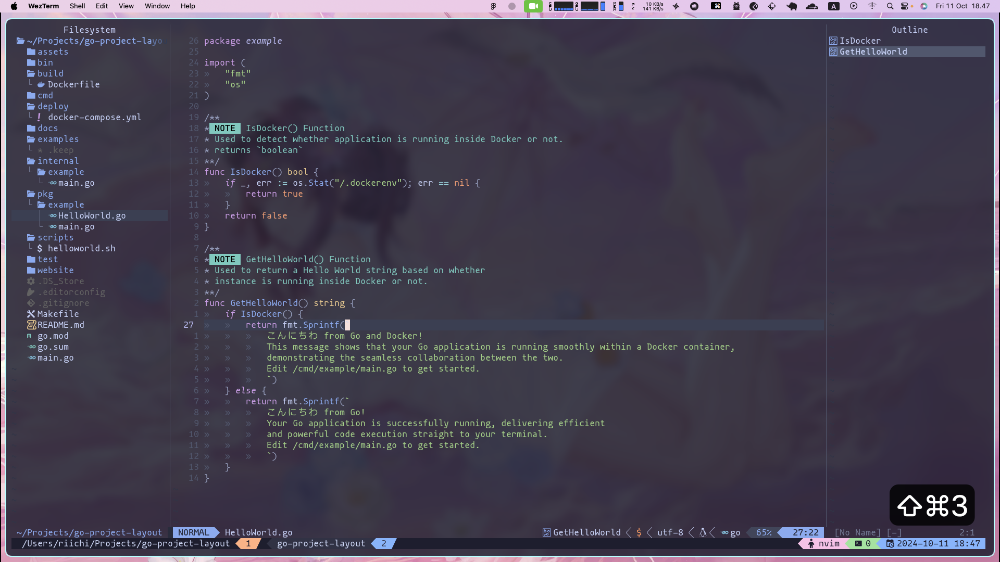

# go-project-structure

**A ready-to-use robust Golang Project Structure**

## Overview

Welcome to your Go Project! This repository follows a well-structured project layout that aims to help you organize your Go applications efficiently. The goal of this layout is to provide a clear separation of different components of your application, making it easier to manage, maintain, and scale.

> Editor in display is [config.nvim](https://github.com/BillyAddlers/config.nvim)

## Installation

Before you get started, ensure you have [Go](https://go.dev/doc/install) installed on your machine. You will also need to change the following variables in the configuration files as necessary:

### `Makefile`:

-   `main_package_path`: Your entry point location (The current one point to root project directory, which is `./main.go`).
-   `binary_name`: Name of your application (Also will be the name of compiled binary).

### `Dockerfile`:

-   `APP_NAME`: Name of your application.
-   `DEBUG`: Set to `true` or `false` based on whether you want to enable debugging.
-   `EXPOSE`: Set to the port you want your container to listen to.

### `docker-compose.yml`:

-   `APP_NAME`: Name of your application.
-   `DEBUG`: Set to `true` or `false` based on whether you want to enable debugging.
-   `ports`: Set tp the port you want your container to listen to (`80:8080` means you are forwarding port 80 on your container to port 8080 on your actual machine).

You can customize these variables in the `Makefile`, `Dockerfile`, and `docker-compose.yml` file on your project directory.

## Project Layout Guidelines

This project follows a specific layout structure, described below:

-   **/assets**: This directory contains any static assets such as images, CSS files, and JavaScript files that are used in your application.

-   **/bin**: This directory holds the compiled binaries of your application. You can run the compiled binaries from here.

-   **/build**: Contains files related to the build process, such as Dockerfiles, Makefiles, and other build scripts.

-   **/cmd**: This is where your application’s entry points are located. Each subdirectory here should be named after the executable that it builds (e.g., `/cmd/myapp`). It typically contains a `main.go` file.

-   **/deploy**: This directory includes deployment scripts and configuration files, such as `docker-compose.yml`, which are used to deploy your application.

-   **/docs**: Contains documentation related to your project, including setup guides, API documentation, and other helpful resources. It may also include additional markdown files that explain how to use or contribute to the project.

-   **/examples**: This directory provides example code or applications that demonstrate how to use your libraries or modules. It serves as a reference for users to understand how to implement your code.

-   **/internal**: This directory holds private application and library code that you don’t want to be imported by other projects. It enforces encapsulation within your project and is not accessible from outside the project.

-   **/pkg**: Contains library code that can be used by external applications. This is where you put packages that are safe to share and import. It's an explicit way to communicate that the code in this directory is designed for reuse.

-   **/scripts**: This directory includes scripts for automation tasks, such as code generation, testing, and other repetitive tasks. These scripts help streamline development and build processes.

-   **/test**: Contains all your unit tests and integration tests. Each file here should be suffixed with `_test.go`. You can structure your tests to mirror the `/cmd`, `/pkg`, and `/internal` directories for clarity.

-   **/website**: This directory contains the code related to your project’s website, if applicable. This may include frontend code, static files, or any other resources necessary for hosting your documentation or project site.

-   **/third_party**: This optional directory can be used to store external dependencies that are not managed by Go modules but are included in your project.

-   **/vendor**: If your project uses vendoring, this directory will contain the dependencies that have been vendored. It is managed by the Go tooling, and you can add dependencies using `go mod vendor`.

### Additional Guidelines

-   **Keep it Simple**: Maintain a clean directory structure that reflects the logic of your application. Avoid creating too many nested directories unless necessary.

-   **File Naming Conventions**: Use clear and descriptive names for your files and directories. This practice improves the readability and maintainability of your code.

-   **Consistency is Key**: Try to maintain consistency in how you structure your directories and files. This will make it easier for other developers to navigate your project.

Feel free to explore and modify this structure as needed to fit the specific requirements of your project.
